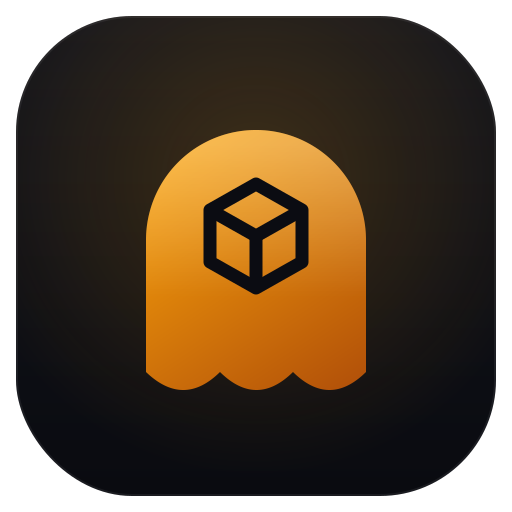

<p align="center">
  
</p>

<h1 align="center">ghostbox</h1>

A static malware analysis sandbox for authorized triage. ghostbox inspects a
suspicious file and produces an explainable threat assessment using safe, static
techniques only.

## Safety

ghostbox performs static analysis only. It NEVER executes, detonates, or runs any
sample. It only reads bytes: it hashes, identifies the file type, parses headers,
extracts imports, strings, and indicators of compromise, computes entropy, applies
optional YARA rules, and aggregates the findings into a score. There is no dynamic
sandbox and no code from the sample is ever invoked.

## Authorized use

Use ghostbox only on files you are authorized to analyze. It is a defensive and
forensic tool intended for incident responders, threat analysts, and researchers
performing triage on samples they have the right to inspect.

## Install

Requires Python 3.11 or newer.

```sh
git clone https://github.com/joemunene-by/ghostbox
cd ghostbox
python -m venv .venv && . .venv/bin/activate
pip install -e .
```

Optional extras enable richer parsing and YARA scanning:

```sh
pip install -e ".[pe]"    # pefile backend for PE imports
pip install -e ".[elf]"   # pyelftools backend for ELF symbols
pip install -e ".[yara]"  # yara-python for rule matching
pip install -e ".[full]"  # all optional backends
pip install -e ".[dev]"   # pytest and ruff for development
```

ghostbox works without any optional backend: it ships built-in fallback parsers
for PE and ELF, and gates YARA off cleanly when yara-python is absent.

## Quickstart

```sh
ghostbox analyze suspicious.sh
```

Example console output on a benign crafted sample (a small script containing IOC
strings, used here only to demonstrate extraction):

```
╭──────────────── ghostbox static analysis ────────────────╮
│ sample.sh  (295 B)                                        │
╰──────────────────────────────────────────────────────────╯
                        Identity
 type    sh script
 sha256  74bdfcf6a5692843bf0a704bc5d1964fd03966b6573e674dd06c1ea6ad486854
                       Capabilities
 networking         6   string:https?://
 persistence        12  CurrentVersion\Run, schtasks
 crypto-ransomware  14  your files have been encrypted
 process-execution  6   powershell
                          IOCs
 urls           http://malicious.example.com/payload.bin
 ipv4           203.0.113.45
 domains        evil-domain.top
 registry_keys  HKLM\Software\Microsoft\Windows\CurrentVersion\Run
       Threat score
 score  51/100
 band   SUSPICIOUS
```

JSON output for pipelines:

```sh
ghostbox analyze suspicious.bin --format json --output report.json
```

Recursively triage a directory, reporting only files at or above a score:

```sh
ghostbox scan ./samples --min-score 40 --format json
```

## Commands

- `analyze <file>`: analyze a single file.
- `scan <dir>`: recursively analyze every regular file in a directory.
- `rules --yara-dir <dir>`: list the YARA rule files that would be loaded.
- `version`: print the ghostbox version.

Common flags: `--format {console,json}`, `--yara-dir`, `--min-score`, `--output`,
`--max-strings`, `--verbose`.

## Analyzers

ghostbox runs a pipeline of modular analyzers. Each one is isolated: a failure in
any analyzer is recorded as a warning and never aborts the run.

1. hashing: md5, sha1, sha256, and file size.
2. filetype: magic-byte detection (PE, ELF, Mach-O, PDF, OLE and OOXML Office,
   scripts, archives, images) without a libmagic dependency.
3. pe: DOS and NT headers, section table with per-section entropy, and imports.
   Uses pefile when installed, otherwise a built-in fallback. Flags suspicious
   imports such as VirtualAlloc, WriteProcessMemory, and CreateRemoteThread.
4. elf: ELF header, section table, and dynamic symbols. Uses pyelftools when
   installed, otherwise a built-in 32 and 64-bit fallback.
5. entropy: whole-file and per-section Shannon entropy with known-packer detection
   (UPX, ASPack, Themida, VMProtect, and others).
6. strings_ioc: ASCII and UTF-16LE strings, then URLs, IPv4 addresses, domains,
   emails, Windows paths, registry keys, and mutexes.
7. capabilities: maps imports and string patterns to behavior tags (networking,
   process injection, persistence, anti-debug, crypto and ransomware indicators,
   discovery, process execution, keylogging).
8. yara: optional rule matching, gated on yara-python.

## Threat score

Each analyzer emits weighted signals. The score is the clamped sum of those weights
on a 0 to 100 scale, mapped to a band:

- clean: score below 25.
- suspicious: score 25 to 59.
- malicious: score 60 and above.

The score is fully explainable. Every report lists each contributing signal with
its weight and a short justification, so an analyst can see exactly why a file was
scored the way it was. Representative weights include known-packer (15), process
injection capability (18), suspicious imports (scaled by count), YARA matches
(scaled by count), and network IOCs (scaled by count).

## YARA usage

Point ghostbox at a directory of `.yar` or `.yara` files:

```sh
pip install -e ".[yara]"
ghostbox analyze suspicious.bin --yara-dir rules
ghostbox rules --yara-dir rules
```

ghostbox compiles every rule file under the directory (recursively) and reports
each match. A sample rule set lives under `rules/`. If yara-python is not
installed, YARA scanning is disabled and the rest of the analysis proceeds.

## Development

```sh
pip install -e ".[dev]"
ruff check .
pytest
```

Tests are fully offline and build their own benign samples programmatically
(tiny valid PE and ELF files, a minimal PDF and Office container, and a script
with IOC strings). No real malware is used or required.

## Roadmap

- Mach-O structural parsing beyond magic detection.
- PDF object and JavaScript inspection, and OLE macro stream extraction.
- Import-hash (imphash) and rich-header fingerprinting for PE.
- Configurable scoring weights and rule packs.
- Optional fuzzy hashing behind an extra, kept off the default install.

## License

MIT. See [LICENSE](LICENSE).
